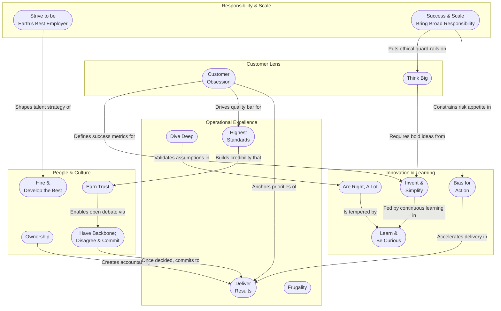

---
sources:
  - https://www.amazon.jobs/content/en/our-workplace/leadership-principles
  - https://www.aboutamazon.com/news/workplace/what-do-each-of-amazons-leadership-principles-really-mean
---
1. [[Customer Obsession]]
2. [[Ownership]]
3. [[Invent and Simplify]]
4. [[Are Right, A Lot]]
5. [[Learn and Be Curious]]
6. [[Hire and Develop the Best]]
7. [[Insist on the Highest Standards]]
8. [[Think Big]]
9. [[Bias for Action]]
10. [[Frugality]]
11. [[Earn Trust]]
12. [[Dive Deep]]
13. [[Have Backbone; Disagree and Commit]]
14. [[Deliver Results]]
15. [[Strive to be Earth's Best Employer]]
16. [[Success and Scale Bring Broad Responsibility]]

# Preparation

## Memorize Verbatim

Amazon assesses you against _exact_ phrasing of all 16 Leadership Principles. Memorize each headline and first sentence of the description:
## Internalize the nuance

Watch Andy Jassy’s breakdown. Watch once for context, then re-watch each principle segment and prepare a one-sentence takeaway.

Jassy explains _why_ “Are Right, A Lot” is paired with “Learn and Be Curious”, and how “Success & Scale” forces Amazonians to think about secondary effects.
## Practice Situational Judgement

Online assessment shows “choose the **best** and **worst** response” scenarios.

1. Read a scenario. Map the dilemma to the most relevant LP(s).
2. Ask, _“What would a leader who obsessively upholds that LP do?”_
3. Eliminate answers that violate any LP (e.g., blaming others breaks Earn Trust).

Doing this repeatedly trains your pattern-matching for the real test.

## Focused Study

[[Success and Scale Bring Broad Responsibility]] and [[Strive to be Earth's Best Employer]] are not included in interviews
[[Frugality]] is included mostly in finance interviews
[[Hire and Develop the Best]] are mostly in manager interviews

![[Pasted image 20250615022911.png]]