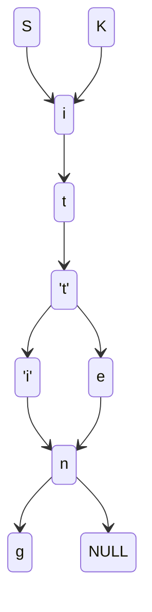

#Google #DailyCodingProblem #Easy
# Problem

The edit distance between two strings refers to the minimum number of character insertions, deletions, and substitutions required to change one string to the other. 

**Example:**
Edit distance between “kitten” and “sitting” is three
- substitute “k” for “s”
- substitute  “e” for “i"
- append “g”

Given two strings, compute the edit distance between them.
# Solution

## Brainstorming

We need to find how many edits it takes to move from x to y

If strings of different lengths then edit distance is at least the length difference

Brute force??
Loop over the two strings
For each character that's different, add to the distance
Can do this with two pointer

```cpp
#include<string>
#include<math>
class Solution {
	int editDistance(string& first, string& second) {
		int distance = abs(first.length() - second.length());
		int n = min(first.length(), second.length());
		for (int i = 0; i < n; i++) {
			if (first[i] != second[i]) distance++;
		}
		return distance;
	}
}

int main() {
	first = "kitten";
	second = "sitting";
	cout << editDistance(first, second) << endl;
}
```

Prefix tree???
How do we get distance in prefix tree?
We just need to count the common nodes between the two trees then subtract that from length of the strings??

## [[Trie|Prefix Tree]]

